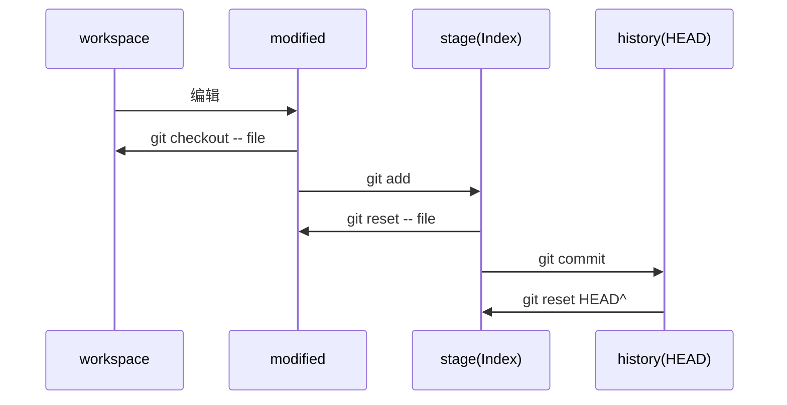

一直在学习 git，特此记录下常用的命令。

<!-- truncate -->

## 设置

> 全局配置文件位置：`~/.gitconfig` 或 `~/.config/git/config` 文件
> 项目配置文件位置：`.git/config`

```bash
git config --global user.name "xxx"
git config --global user.email "xxx@y163.com"
git config --global core.editor vim # 配置默认编辑器

git config --list  # 查看配置
git config -e      # 编辑配置
git config --global ... # 操作全局配置
```

## git 概念

三个区域：工作目录 (未修改的文件、已修改的文件)、暂存区 stage (Index)、仓库 history (HEAD)。

## 项目操作


#### 创建

```bash
git clone <server> # 克隆网络仓库
git init    # 将当前目录初始化为git仓库
git remote add origin <server> # 当前git目录绑定远程仓库
```

#### 状态

```bash
git status      # 查看状态
git status -s   # 简略查看状态(-s=--short)
```

#### 添加和复原

```bash
git add <file>           # 添加指定文件到stage
git add *                # 添加所有文件到stage

git reset -- <file>      # 将添加的文件恢复到unstage
git reset --hard HEAD    # (Danger)重置所有文件(history->workspace)

git checkout -- <file>   # (Danger)指定文件恢复为上次提交(unstage->workspace)
git checkout HEAD <file> # (Danger)从当前仓库中获取/覆盖文件(history->workspace)
```

#### 代码比较

```bash
git diff            # 未追踪文件比较
git diff --cached   # 已追踪文件比较(--cached=--staged)
```

#### 提交

```bash
git commit               # 提交
git commit -m "message"  # 提交(-m=--message)
git commit -am "message" # 将所有修改的文件进行追踪并提交
git commit --amend       # 修改上次提交
git reset HEAD^          # 取消当前提交(HEAD-->stage)
```

#### 日志

```bash
git log                  # 查看日志
git log --oneline        # 单行显示(--pretty=oneline)
git log --graph          # 图表显示
git log --author=<user>  # 指定提交作者
git log -p               # 附带上每次修改的具体内容
git log -5               # 控制输出条数
git log --stat           # 每条记录显示总结
```

#### 分支

```bash
git branch <new branch>      # 从当前代码拉新分支
git checkout <branch/commit> # 切换到分支/某版本
git checkout -b <new branch> # 从当前代码拉新分支并切换到新分支(等同上面两条命令)
git branch -d <branch>       # 删除分支(如果未合并则删除失败)
git branch -D <branch>       # 强制删除分支
git branch -a                # 列出所有分支
```

#### 分支合并

```bash
git merge <branch>          # 分支合并
git merge --no-ff <branch>  # 分支合并，禁用fast-forward
git merge --squash <branch> # 将分支多条提交整合并合并
git rebase -i               # 交互式变基
git cherry-pick <commitId>  # 检出某次提交到当前分支
```

#### 贮藏

```bash
git stash       # 贮藏当前unstage代码
git stash -u    # 贮藏当前stage和unstage代码，即所有修改未提交代码(-u=--include-untracked)
git stash list  # 查看贮藏
git stash pop   # 取出最后一个贮藏，并从贮藏中移除
git stash apply # 取出最后一个贮藏
git stash drop  # 丢弃贮藏
```

#### 标签

```bash
git tag <tag>             # 在当前提交打标签
git tag <tag> <commitId>  # 在指定commitId上打标签
git tag -d <tag>          # 删除标签
```

#### 版本写法

```bash
git show HEAD     # 当前最新提交
git show HEAD~1   # 上一次提交
git show HEAD^    # 同上，上一次提交
git show HEAD~2   # 上两次提交
git show HEAD^^   # 同上，上两次提交
git show HEAD@{1} # 第一次提交
```

#### 区间写法

```bash
git log master dev  # 即在mater也在dev中
git log master..dev # 在dev中却不在master中
git log ^master dev # 同上，不在master却在dev中
git log dev --not master # 同上，在dev中却不在master中

git log master...dev # 在两个分支中，所有差异的提交。是下侧两者的集合
git log ^master dev
git log master ^dev

git log origin/master..HEAD  # 查看你即将推送到远端的内容
git log origin/master..      # 简写，同上一条
```

#### 代码搜索与调试

```bash
git grep <word>     # 检索单词
git grep -n <word>  # 带上行号(-n==--line-number)
git grep -c <word>  # 统计在每个文件中出现次数(-c=--count)
git log -S <word> --oneline  # 查找单词被修改的提交

git blame <file>    # 查看文件每行修改
git bisect start    # git 区间二分法查找
git bisect bad
git bisect good v1.0
```

#### 同步

```bash
git fetch       # 拉取代码
git pull        # 拉取代码并合并到当前分支
git push        # 推送代码
git push --tags # 同步标签
git remote update origin --prune # 更新远程分支列表
git push origin :<branch>        # 删除远程分支
git push origin :refs/tags/<tag> # 删除远程标签
```

#### 其他

```bash 
git bundle create repo.bundle HEAD master  # 项目打包
git reflog # 查阅HEAD日志
```

## git alias

自己网上找的，因为查看日志最麻烦，所以仅仅收集了日志部分。现在也很少使用了。主要在用系统 alias。

```bash
alias.l=log --graph --all --pretty=format:'%C(yellow)%h%C(cyan)%d%Creset %s %C(white)- %an, %ar%Creset'
alias.ll=log --stat --abbrev-commit
alias.lg=log --color --graph --pretty=format:'%C(bold white)%h%Creset -%C(bold green)%d%Creset %s %C(bold green)(%cr)%Creset %C(bold blue)<%an>%Creset' --abbrev-commit --date=relative
alias.llg=log --color --graph --pretty=format:'%C(bold white)%H %d%Creset%n%s%n%+b%C(bold blue)%an <%ae>%Creset %C(bold green)%cr (%ci)' --abbrev-commit
```

## alias(git-plugin)

从 oh-my-zsh 中拿来的，大部分都用不到...

```bash
g=git
ga='git add'
gaa='git add --all'
gap='git apply'
gapa='git add --patch'
gau='git add --update'
gav='git add --verbose'
gb='git branch'
gbD='git branch -D'
gba='git branch -a'
gbd='git branch -d'
gbda='git branch --no-color --merged | command grep -vE "^(\*|\s*(master|develop|dev)\s*$)" | command xargs -n 1 git branch -d'
gbl='git blame -b -w'
gbnm='git branch --no-merged'
gbr='git branch --remote'
gbs='git bisect'
gbsb='git bisect bad'
gbsg='git bisect good'
gbsr='git bisect reset'
gbss='git bisect start'
gc='git commit -v'
'gc!'='git commit -v --amend'
gca='git commit -v -a'
'gca!'='git commit -v -a --amend'
gcam='git commit -a -m'
'gcan!'='git commit -v -a --no-edit --amend'
'gcans!'='git commit -v -a -s --no-edit --amend'
gcb='git checkout -b'
gcd='git checkout develop'
gcf='git config --list'
gcl='git clone --recurse-submodules'
gclean='git clean -fd'
gcm='git checkout master'
gcmsg='git commit -m'
'gcn!'='git commit -v --no-edit --amend'
gco='git checkout'
gcount='git shortlog -sn'
gcp='git cherry-pick'
gcpa='git cherry-pick --abort'
gcpc='git cherry-pick --continue'
gcs='git commit -S'
gcsm='git commit -s -m'
gd='git diff'
gdca='git diff --cached'
gdct='git describe --tags `git rev-list --tags --max-count=1`'
gdcw='git diff --cached --word-diff'
gds='git diff --staged'
gdt='git diff-tree --no-commit-id --name-only -r'
gdw='git diff --word-diff'
gf='git fetch'
gfa='git fetch --all --prune'
gfo='git fetch origin'
gg='git gui citool'
gga='git gui citool --amend'
ggpull='git pull origin "$(git_current_branch)"'
ggpush='git push origin "$(git_current_branch)"'
ggsup='git branch --set-upstream-to=origin/$(git_current_branch)'
ghh='git help'
gignore='git update-index --assume-unchanged'
gignored='git ls-files -v | grep "^[[:lower:]]"'
git-svn-dcommit-push='git svn dcommit && git push github master:svntrunk'
gk='\gitk --all --branches'
gke='\gitk --all $(git log -g --pretty=%h)'
gl='git pull'
glg='git log --stat'
glgg='git log --graph'
glgga='git log --graph --decorate --all'
glgm='git log --graph --max-count=10'
glgp='git log --stat -p'
glo='git log --oneline --decorate'
glod='git log --graph --pretty='\''%Cred%h%Creset -%C(auto)%d%Creset %s %Cgreen(%ad) %C(bold blue)<%an>%Creset'\'
glods='git log --graph --pretty='\''%Cred%h%Creset -%C(auto)%d%Creset %s %Cgreen(%ad) %C(bold blue)<%an>%Creset'\'' --date=short'
glog='git log --oneline --decorate --graph'
gloga='git log --oneline --decorate --graph --all'
glol='git log --graph --pretty='\''%Cred%h%Creset -%C(auto)%d%Creset %s %Cgreen(%cr) %C(bold blue)<%an>%Creset'\'
glola='git log --graph --pretty='\''%Cred%h%Creset -%C(auto)%d%Creset %s %Cgreen(%cr) %C(bold blue)<%an>%Creset'\'' --all'
glols='git log --graph --pretty='\''%Cred%h%Creset -%C(auto)%d%Creset %s %Cgreen(%cr) %C(bold blue)<%an>%Creset'\'' --stat'
glp=_git_log_prettily
glum='git pull upstream master'
gm='git merge'
gma='git merge --abort'
gmom='git merge origin/master'
gmt='git mergetool --no-prompt'
gmtvim='git mergetool --no-prompt --tool=vimdiff'
gmum='git merge upstream/master'
gp='git push'
gpd='git push --dry-run'
gpf='git push --force-with-lease'
'gpf!'='git push --force'
gpoat='git push origin --all && git push origin --tags'
gpristine='git reset --hard && git clean -dfx'
gpsup='git push --set-upstream origin $(git_current_branch)'
gpu='git push upstream'
gpv='git push -v'
gr='git remote'
gra='git remote add'
grb='git rebase'
grba='git rebase --abort'
grbc='git rebase --continue'
grbd='git rebase develop'
grbi='git rebase -i'
grbm='git rebase master'
grbs='git rebase --skip'
grep='grep  --color=auto --exclude-dir={.bzr,CVS,.git,.hg,.svn}'
grh='git reset'
grhh='git reset --hard'
grm='git rm'
grmc='git rm --cached'
grmv='git remote rename'
grrm='git remote remove'
grset='git remote set-url'
grt='cd $(git rev-parse --show-toplevel || echo ".")'
gru='git reset --'
grup='git remote update'
grv='git remote -v'
gsb='git status -sb'
gsd='git svn dcommit'
gsh='git show'
gsi='git submodule init'
gsps='git show --pretty=short --show-signature'
gsr='git svn rebase'
gss='git status -s'
gst='git status'
gsta='git stash save'
gstaa='git stash apply'
gstall='git stash --all'
gstc='git stash clear'
gstd='git stash drop'
gstl='git stash list'
gstp='git stash pop'
gsts='git stash show --text'
gsu='git submodule update'
gts='git tag -s'
gtv='git tag | sort -V'
gunignore='git update-index --no-assume-unchanged'
gunwip='git log -n 1 | grep -q -c "\-\-wip\-\-" && git reset HEAD~1'
gup='git pull --rebase'
gupa='git pull --rebase --autostash'
gupav='git pull --rebase --autostash -v'
gupv='git pull --rebase -v'
gwch='git whatchanged -p --abbrev-commit --pretty=medium'
gwip='git add -A; git rm $(git ls-files --deleted) 2> /dev/null; git commit --no-verify -m "--wip-- [skip ci]"'
```

## 参考文档

* [git简明指南](http://rogerdudler.github.io/git-guide/index.zh.html)
* [Git教程(廖雪峰)](https://www.liaoxuefeng.com/wiki/0013739516305929606dd18361248578c67b8067c8c017b000)
* [Git飞行规则(Flight Rules)](https://github.com/k88hudson/git-flight-rules/blob/master/README_zh-CN.md)
* [图解Git](http://marklodato.github.io/visual-git-guide/index-zh-cn.html)
* [Learn Git Branching](https://learngitbranching.js.org/)
* [git book](https://book.git-scm.com/book/zh/v2)
